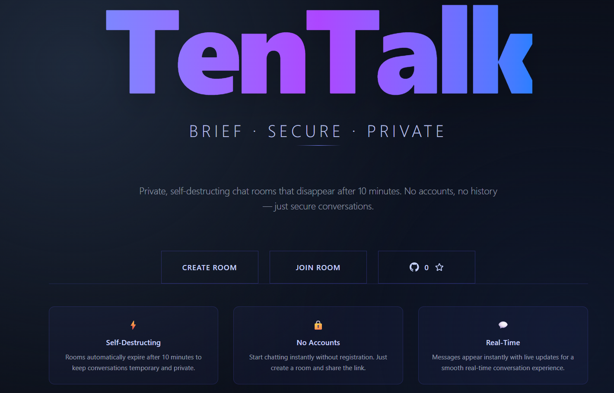

# TenTalk
A private, self-destructing chat room application. Rooms automatically expire after 10 minutes, ensuring ephemeral conversations.

## Demo --> [View Demo](https://tentalkk.vercel.app/)


## Features

- **Self-Destructing Rooms**: Automatic expiration after 10 minutes
- **Real-Time Messaging**: Instant delivery via Upstash Realtime
- **Message Reactions**: Add/remove emoji reactions
- **Read Receipts**: Track message read status
- **Typing Indicators**: See when others are typing
- **Presence System**: Online/offline status tracking
- **Connection Notifications**: Join/leave announcements
- **Message Deletion**: Delete your own messages
- **Token-Based Auth**: Secure room access via cookies

## Tech Stack

**Frontend**
- Next.js 16 (App Router)
- React 19 with React Compiler
- TanStack Query
- COSS UI + Tailwind CSS 4
- TypeScript

**Backend**
- Elysia (Bun runtime)
- Upstash Redis (serverless)
- Upstash Realtime (pub/sub)
- Eden Treaty (type-safe client)

## Architecture

### Overview

TenTalk follows a serverless architecture pattern:

```
┌─────────────┐      ┌──────────────┐      ┌─────────────┐
│   Next.js   │─────▶│  Elysia API  │─────▶│   Upstash   │
│   Client    │      │   Routes     │      │   Redis     │
└─────────────┘      └──────────────┘      └─────────────┘
       │                     │                      │
       │                     │                      │
       └─────────────────────┼──────────────────────┘
                             │
                    ┌────────▼────────┐
                    │ Upstash Realtime│
                    └─────────────────┘
```

**Data Flow**
1. Room creation generates nanoid, stores metadata in Redis with 10min TTL
2. Messages validated via Zod, stored in Redis, broadcast via Realtime
3. Real-time events (typing, presence, reactions) published to room channels
4. Automatic cleanup via Redis TTL expiration

**Key Design Decisions**
- **Elysia in API routes**: Type-safe APIs with Eden Treaty for end-to-end type safety
- **Upstash**: Serverless Redis + Realtime, no infrastructure management, global edge network
- **Token auth**: Cookie-based tokens stored in Redis for room access validation

## Getting Started

### Prerequisites
- Bun >= 1.0.0
- Upstash account (Redis + Realtime)

### Setup

### Installation

1. Clone the repository:
```bash
git clone https://github.com/nikhilsundriya/TenTalk
cd TenTalk
```

2. Install dependencies:
```bash
bun install
```

3. Set up environment variables:
```bash
cp .env.example .env
```

Required environment variables:
```env
UPSTASH_REDIS_REST_URL=your_redis_rest_url
UPSTASH_REDIS_REST_TOKEN=your_redis_rest_token
```

Get these values from your [Upstash Console](https://console.upstash.com/).

4. Run the development server:
```bash
bun dev
```

5. Open [http://localhost:3000](http://localhost:3000) in your browser.

## Project Structure

```
TenTalk/
├── app/                           # Next.js App Router
│   ├── api/                       # API routes
│   │   ├── [[...slugs]]/          # Catch-all route for Elysia
│   │   │   ├── auth.ts            # Authentication handlers
│   │   │   └── route.ts           # Elysia route handler
│   │   └── realtime/              # Realtime API route
│   │       └── route.ts
│   ├── create/                    # Room creation page
│   │   └── page.tsx
│   ├── room/                      # Room pages
│   │   └── [roomId]/              # Dynamic room route
│   │       └── page.tsx
│   ├── layout.tsx                 # Root layout
│   ├── page.tsx                   # Home/landing page
│   ├── globals.css                # Global styles
│   └── favicon.ico
├── components/                     # React components
│   ├── ui/                        # Base UI components (COSS UI)
│   │   ├── button.tsx
│   │   ├── input.tsx
│   │   ├── dialog.tsx
│   │   └── ...                    # Other UI primitives
│   ├── message-actions.tsx        # Message action buttons
│   ├── message-input.tsx          # Message input component
│   ├── message-item.tsx           # Individual message display
│   ├── message-list.tsx           # Message list container
│   ├── message-reactions.tsx      # Reaction UI
│   ├── room-header.tsx            # Room header with controls
│   ├── countdown-timer.tsx        # TTL countdown display
│   ├── connection-notification.tsx # Join/leave notifications
│   ├── copy-button.tsx            # Copy to clipboard
│   ├── presence-indicator.tsx     # Online/offline status
│   ├── typing-indicator.tsx       # Typing status display
│   ├── read-receipt.tsx           # Read receipt display
│   ├── user-avatar.tsx            # User avatar component
│   ├── username-display.tsx        # Username display
│   ├── hero-landing.tsx           # Landing page hero
│   ├── landing-page.tsx           # Landing page component
│   ├── page-header.tsx            # Page header component
│   ├── providers.tsx              # React providers wrapper
│   └── index.ts                   # Component exports
├── hooks/                          # Custom React hooks
│   ├── use-username.ts            # Username management
│   └── use-mobile.ts              # Mobile detection
├── lib/                            # Core utilities
│   ├── client.ts                  # Eden Treaty API client
│   ├── realtime.ts                # Realtime server setup
│   ├── realtime-client.ts         # Client-side realtime hook
│   ├── redis.ts                   # Redis client
│   ├── schemas.ts                 # Zod validation schemas
│   ├── user-colors.ts             # User color assignment
│   └── utils.ts                   # Shared utilities
├── public/                         # Static assets
│   ├── file.svg
│   ├── globe.svg
│   ├── next.svg
│   ├── vercel.svg
│   └── window.svg
├── proxy.ts                        # Development proxy
├── components.json                 # UI component config
├── next.config.ts                  # Next.js configuration
├── tsconfig.json                   # TypeScript configuration
├── postcss.config.mjs              # PostCSS configuration
├── eslint.config.mjs               # ESLint configuration
├── package.json                    # Dependencies
└── README.md                       # This file
```

## Development

**Type Safety**: End-to-end type safety via Zod → Elysia → Eden Treaty → TypeScript

**Real-Time Testing**: Open multiple tabs/windows, create a room, messages sync instantly

**Available Scripts**
- `bun dev` - Development server
- `bun build` - Production build
- `bun start` - Production server

## Production

**Deployment**: Works on any Next.js-compatible platform (Vercel recommended)

**Environment**: Set all Upstash credentials in your deployment platform

**Redis Structure**
- `meta:{roomId}` - Room metadata (Hash, 10min TTL)
- `messages:{roomId}` - Message list (List, 10min TTL)
- `users:{roomId}` - User mappings (Hash, 10min TTL)
- `presence:{roomId}` - Presence data (Hash, 10min TTL)

**Security**
- Room IDs are unguessable (nanoid)
- Token-based authentication per room
- Input validation via Zod schemas
- Consider rate limiting for production

## License

See [LICENSE](LICENSE) file for details.
